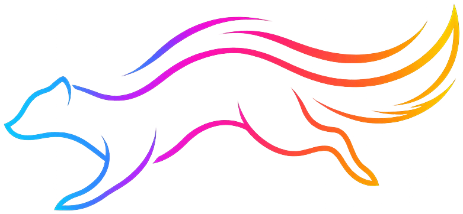

### A cross-platform, GPU-first raster image editor with local AI.

---

> **Disclaimer**
> 
> Sable is provided as is and is under active development. There is no guarantee  
> of ongoing maintenance. You are free to open pull requests or fork it.

---

## What is Sable?

Sable is a Photoshop/Affinity-style raster image editor that runs on Windows,  
macOS, and Linux. It is **GPU-first**: the canvas is a real GPU surface (wgpu →  
DX12 / Vulkan / Metal through one API), and the document is a non-destructive  
node graph that the GPU compositor recomputes on every change — adjustments,  
live filters, masks, and layer effects are all first-class, serializable,  
undoable graph nodes, never baked-in pixels.

It also ships a **local AI** light tier that runs in-process on the GPU with no  
Python and no cloud: smart selection, background removal, upscale, and object  
removal. A heavier opt-in **generative tier** — Generative Fill and  
text-to-image through a locally managed ComfyUI runtime — is fully decoupled:  
nothing is installed until you enable it, and the base app stays lean and  
offline.

Sable is MIT-licensed. AI **model weights are always user-provided** — Sable  
ships pointers and shows each model's licence before download, never the  
weights themselves.

## Features

### Editing

*   GPU compositor with the full Photoshop + Affinity blend-mode set; linear-float  
    working space.
*   Non-destructive **layer graph**: pixel / shape / text / vector-path / group  
    layers, adjustment layers, live filter layers, per-layer masks and effects.
*   **Adjustments** — Brightness/Contrast, Levels (+ output levels), Curves, HSL,  
    Exposure, Vibrance, Threshold, Posterise, Invert, B&W, White Balance, Colour  
    Balance, Channel Mixer.
*   **Live filters** — Gaussian / Box / Motion / Zoom blur, Sharpen, Unsharp,  
    High Pass, Clarity, Add Noise, Denoise.
*   **Layer effects** — drop shadow, outer/inner glow, stroke, colour & gradient  
    overlay, bevel/emboss.
*   Tiled (256×256) GPU-resident layer storage with a shared atlas + LRU residency  
    for bounded VRAM regardless of document size.

### Tools

*   Brush / pencil / eraser (hardness, flow, HUD size-adjust), bucket fill,  
    eyedropper, clone / heal / spot-heal / patch, liquify, mesh warp.
*   Selections — marquee (rect/ellipse), lasso, magic wand, colour range, with  
    add / subtract / intersect combine modes.
*   Move + full affine **transform** (rotate, non-uniform scale, shear,  
    perspective/free-distort), align & distribute.
*   Vector **pen / node** tools and shapes (rectangle, rounded-rect, ellipse,  
    line, polygon, star, arrow) with caps/joins/dashes; **type** with area text,  
    text-on-path, and text-to-curves.

### Local AI (light tier — no Python)

*   **Smart selection** (SAM 2) — hover-to-select with automatic mask generation.
*   **Background removal** (BiRefNet / RMBG).
*   **Upscale** (Real-ESRGAN) with seamless tiling.
*   **Object removal / inpaint** (LaMa).
*   Built-in model manager: curated download pointers (licence shown per model),  
    any-URL / HuggingFace import, per-task defaults, and VRAM-fit badges.

### Generative AI (opt-in — ComfyUI)

*   **Generative Fill** and **Generate Image** — fill a selection or create an  
    image from a text prompt, driven by a local **ComfyUI** runtime that Sable  
    installs and manages in the background. Nothing is installed until you  
    enable it in Preferences.
*   **Reuses an existing ComfyUI install** if one is found — checkpoints and  
    LoRAs are referenced in place, never copied.
*   **Full workflow import** — bring your own workflow, exported in ComfyUI's  
    API format. Your graph stays the source of truth; Sable injects the image,  
    prompt, seed, steps, CFG, LoRAs and model picks at run time, so any  
    architecture your workflow supports just works.
*   Generative panel with model presets, compatible LoRAs, prompt / negative  
    prompt, steps, CFG, denoise, seed, and CPU offload for models larger than  
    your VRAM.

### Workspace

*   Multi-document tabs, history panel with non-linear undo + named snapshots,  
    command palette, rebindable hotkeys, light / gray / dark themes, rulers,  
    guides, grid, and a customisable canvas overlay.
*   Native `.sable` format (layers + history), plus PNG import/export.

## Install

Pre-built installers are produced per release for all three platforms:

*   **Windows** — `sable-windows-x64-setup.exe` (Inno Setup; associates `.sable`).
*   **macOS** — `sable-macos-x64.dmg` / `sable-macos-arm64.dmg` (drag to  
    Applications). The bundle is ad-hoc signed; on first launch use  
    right-click → Open to bypass Gatekeeper for an unsigned build.
*   **Linux** — `Sable-x86_64.AppImage` (`chmod +x`, then run).

Grab them from the [Releases](https://github.com/Drommedhar/sable/releases) page.

## Build from source

Requires the **.NET 10 SDK**. A GPU with DX12 / Vulkan / Metal is required to  
run the app (the canvas is GPU-only); unit tests are headless.

```
dotnet build                                   # whole solution (Sable.slnx)
dotnet test  tests/Sable.Tests                 # headless unit tests
dotnet run   --project src/Sable.App           # run the editor
dotnet run   --project src/Sable.Gpu.Spike     # GPU smoke (compute + compositor -> PNG)
```

### Packaging a release

Tag a commit (`vX.Y.Z`) and push — the  
[`release`](.github/workflows/release.yml) workflow publishes a self-contained  
single-file build per RID and packages it: Windows installer (Inno Setup),  
macOS `.app` + DMG, and Linux AppImage. The app version is derived from the tag.

## Architecture

| Module | Responsibility |
| --- | --- |
| `Sable.App` | Avalonia shell (chrome, menus, panels, dialogs). |
| `Sable.UI` | MVVM view-models (CommunityToolkit.Mvvm). |
| `Sable.Canvas` | GPU surface host embedded in Avalonia; platform input seam. |
| `Sable.Engine` | Document graph, layers, GPU compositor. |
| `Sable.Gpu` | wgpu binding (Silk.NET.WebGPU) + WGSL shaders. |
| `Sable.Imaging` | Codecs, colour, tiling, IO. |
| `Sable.Tools` | Tool logic (brush, selection, transform, ...). |
| `Sable.Ai` | ONNX Runtime light tier + orchestration. |
| `Sable.Format` | `.sable` container IO + history. |
| `Sable.Core` | Math, colour, undo, settings, AI contracts. |

The engine is UI-agnostic and headless-testable; the only per-OS code is the  
canvas surface + input backend (`IPlatformBackend` / `IInputSource`).

## Support the Project

If you find Sable useful and want to support its development:

[](https://www.paypal.com/donate/?hosted_button_id=EQJG5JHAKYU4S)

[Buy me a coffee on Ko-fi](https://ko-fi.com/drommedhar)

## License

Sable is released under the [MIT License](LICENSE). Third-party components and  
their licenses are listed in [THIRD-PARTY-NOTICES.md](THIRD-PARTY-NOTICES.md).  
AI model weights are not bundled and remain under their own licenses.